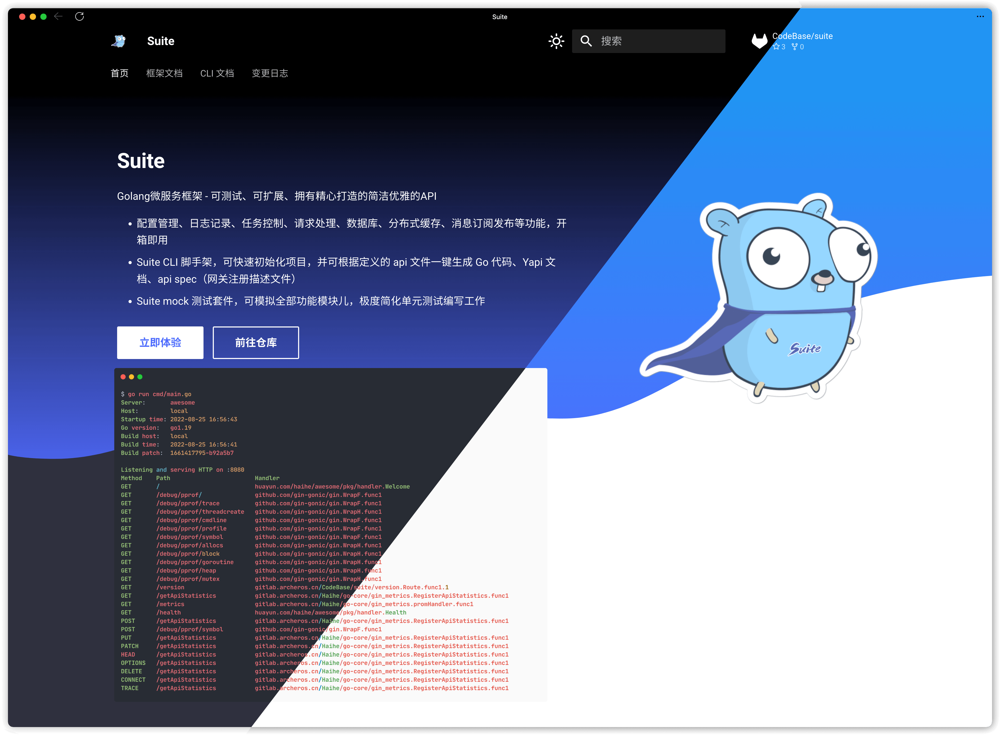

# suite-go.github.io

The `main` branch of this repository is exactly what is shown on https://suite-go.github.io/. 

Contributions are always welcome through Pull requests. Issues can also be made, if you don't want to do the work yourself (or want to discuss it beforehand).

